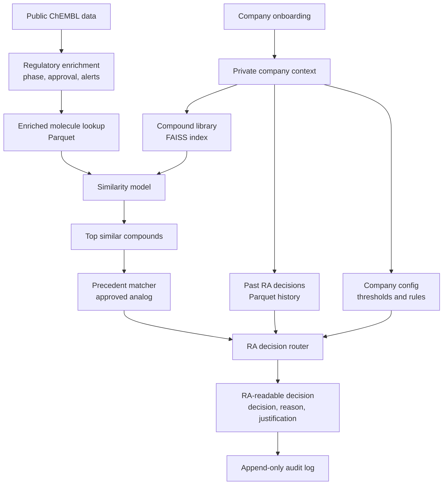

# Regulatory Decision Intelligence for Molecular Similarity

## Problem ?

Regulatory Affairs teams do not only need a model score. They need to understand why a compound may be acceptable, risky, similar to an approved precedent, or blocked by a safety rule.

In many pharma workflows, the useful information is scattered across public data, internal compound libraries, past company decisions, structural alert rules, and manual RA judgement. A binary prediction is not enough for GxP-style work because every decision must be explainable, traceable, and auditable.

## Why this project?

This project turns a molecular similarity workflow into a regulatory decision-intelligence system.

The idea is simple: keep the ML model focused on molecular similarity, then add deterministic regulatory layers around it. That gives RA officers a structured answer they can read, adjust, audit, and defend without retraining the model for every company.

## What we did ?

I built the project step by step:

- Imported and modeled ChEMBL-derived molecule activity data.
- Enriched compounds with regulatory-assessment metadata such as `max_phase`, first approval year, therapeutic area, black-box warning, and route flags.
- Added RDKit SMARTS structural alert flags, including nitrosamine, epoxide, aromatic amine, nitro aromatic, PAINS, and other risk patterns.
- Built an enriched molecule lookup file for inference: `data/enriched_molecules.parquet`.
- Added a JSON-configurable company compliance layer validated by Pydantic.
- Added a deterministic RA decision router where alert escalation overrides model score.
- Added a precedent matcher that finds the most relevant approved analog.
- Replaced score-only output with a full RA-readable response schema.
- Added append-only audit logging for prediction calls.
- Added company onboarding endpoints for internal libraries and past RA decisions.
- Added multi-tenant isolation so each company has separate indexes, history, configs, and audit logs.
- Added Docker Compose mounts so company data persists across container restarts.
- Added an end-to-end mock company test with 20 compounds and 10 RA decisions.

## The solution

The final system produces an auditable regulatory decision object, not just a probability.

Example output shape:

```json
{
  "company_id": "mock_company",
  "decision": "block",
  "reason": "Alert escalation override: alerts_nitrosamine triggered critical block.",
  "ra_justification": {
    "summary": "Alert escalation override applied.",
    "score_rationale": "The model score was high, but deterministic alert rules apply.",
    "alert_rationale": "Nitrosamine alert is configured as critical block.",
    "precedent_rationale": "An approved analog was attached as context.",
    "history_rationale": "Company RA history was available for precedent context."
  },
  "score": {
    "model_score": 0.93,
    "confidence_band": "high"
  },
  "top_analog": {
    "chembl_id": "MC-001",
    "name": "Mock Compound 1",
    "max_phase": 4.0,
    "approval_year": 2026
  }
}
```

The ML model still gives the similarity signal. The compliance layer turns that signal into a regulatory answer.

## Simple System Diagram



## Main Components

### 1. ChEMBL ETL and regulatory enrichment

The ETL pipeline imports compact ChEMBL activity data, stores it in SQLite, creates activity-derived molecule pairs, and exports modeling data.

Important outputs:

- `data/chembl.db`
- `data/chembl_modeling.csv`

Important file:

- `scripts/etl_pipeline.py`

Regulatory metadata added to molecules includes:

- `max_phase`
- `first_approval`
- `therapeutic_area`
- `indication_count`
- `black_box_warning`
- `molecule_type`
- route flags: `oral`, `parenteral`, `topical`
- target-derived safety context

### 2. RDKit structural alert flags

Each molecule is checked with a curated SMARTS alert library.

Examples:

- `alerts_nitrosamine`
- `alerts_epoxide`
- `alerts_aziridine`
- `alerts_alkyl_halide`
- `alerts_aldehyde`
- `alerts_hydrazine`
- `alerts_aromatic_amine`
- `alerts_michael_acceptor`
- `alerts_nitro_aromatic`
- `alerts_polycyclic_aromatic`
- `alerts_pains`

These flags become deterministic regulatory risk signals.

### 3. Enriched molecule lookup

The project builds a molecule-level inference lookup:

- `data/enriched_molecules.parquet`

It includes:

- Morgan fingerprints
- MACCS fingerprints
- RA metadata
- alert flags
- compound identifiers

Important file:

- `scripts/build_enriched_molecules.py`

### 4. Similarity model

The strongest current model path is the SQL-backed activity-pair model.

Important file:

- `src/molecular_similarity/sql_activity_model.py`

Held-out SQL test metrics from the current report:

- accuracy: `0.7313`
- precision: `0.6243`
- recall: `0.5567`
- F1: `0.5885`
- log loss: `0.5301`

The model provides a similarity probability. It does not make the final regulatory decision alone.

### 5. Company compliance config

Each company can have a human-readable JSON config.

Example:

- `configs/example_company_config.json`

Schema:

- `schemas/company_config.schema.json`

Important file:

- `src/molecular_similarity/compliance_config.py`

The config controls:

- jurisdictions
- therapeutic focus
- similarity thresholds
- safety risk thresholds
- phase policy
- structural alert actions
- deterministic rule behavior

This is the personalization layer. It does not retrain the model.

### 6. RA decision router

The RA router takes:

- model score
- alert flags
- company config

It returns:

- `decision`
- `reason`

Important file:

- `src/molecular_similarity/ra_decision_router.py`

Rule principle:

```text
Alert escalation always overrides score.
```

So a high model score can still become `block` if a company config marks a triggered alert as critical.

### 7. Precedent matcher

The precedent matcher looks through the top similar compounds and returns the most relevant approved analog.

Important file:

- `src/molecular_similarity/precedent_matcher.py`

Output:

```python
{
    "chembl_id": "...",
    "name": "...",
    "max_phase": 4.0,
    "approval_year": 2012
}
```

This gives RA officers a precedent-style explanation, not only a model score.

### 8. RA response schema

The API response is a full decision object validated by Pydantic.

Important file:

- `src/molecular_similarity/ra_response_schema.py`

The response includes:

- decision
- reason
- `ra_justification`
- score summary
- triggered alerts
- top approved analog
- thresholds used
- audit trail

### 9. Audit logging

Every prediction call can be logged before the response is returned.

Important file:

- `src/molecular_similarity/audit_middleware.py`

Output:

- `audit/{company_id}/log.jsonl`

The log is append-only JSONL and stores request and response context.

### 10. Company onboarding

Companies can upload their own internal compound library and RA decision history.

Important file:

- `src/molecular_similarity/company_onboarding.py`

Library upload:

- accepts SDF or SMILES CSV
- standardizes compounds with RDKit
- generates Morgan fingerprints
- stores a FAISS index

Output:

- `indexes/{company_id}/faiss.index`
- `indexes/{company_id}/metadata.json`

RA history upload:

- accepts past decisions as CSV
- maps rows to compound identifiers and SMILES
- stores company RA precedent data

Output:

- `history/{company_id}/ra_decisions.parquet`

### 11. Multi-tenant isolation

Each company has its own namespace.

Important file:

- `src/molecular_similarity/tenant_namespace.py`

Storage pattern:

```text
configs/{company_id}/...
indexes/{company_id}/...
history/{company_id}/...
audit/{company_id}/...
rag/{company_id}/...
```

Company IDs are normalized into safe path names, so one company cannot escape into another company's storage.

## Project Files

Core regulatory intelligence modules:

- `src/molecular_similarity/compliance_config.py`
- `src/molecular_similarity/ra_decision_router.py`
- `src/molecular_similarity/precedent_matcher.py`
- `src/molecular_similarity/ra_response_schema.py`
- `src/molecular_similarity/audit_middleware.py`
- `src/molecular_similarity/api.py`
- `src/molecular_similarity/company_onboarding.py`
- `src/molecular_similarity/tenant_namespace.py`

Core data and model modules:

- `scripts/etl_pipeline.py`
- `scripts/build_enriched_molecules.py`
- `src/molecular_similarity/sql_activity_model.py`
- `src/molecular_similarity/chembl_baseline_models.py`
- `src/molecular_similarity/threshold_model.py`
- `src/molecular_similarity/linear_regression_baseline.py`

Validation and examples:

- `configs/example_company_config.json`
- `schemas/company_config.schema.json`
- `tests/test_mock_company_e2e.py`
- `tests/test_company_onboarding.py`
- `tests/test_ra_response_schema.py`
- `tests/test_audit_middleware.py`
- `tests/test_tenant_namespace.py`

## How To Run

### Local setup

```bash
python3.11 -m venv .venv
source .venv/bin/activate
pip install -e '.[dev]'
```

### Build the ChEMBL modeling export

```bash
python scripts/etl_pipeline.py \
  --db ./data/chembl.db \
  --create-schema \
  --import-compact-chembl \
  --generate-activity-pairs \
  --export ./data/chembl_modeling.csv \
  --stats
```

### Build the enriched molecule lookup

```bash
python scripts/build_enriched_molecules.py \
  --db ./data/chembl.db \
  --output ./data/enriched_molecules.parquet
```

### Validate company config

```bash
molecular-similarity-company-config configs/example_company_config.json
molecular-similarity-company-config --print-schema
```

### Run the production API

```bash
molecular-similarity-api
```

Equivalent direct command:

```bash
uvicorn molecular_similarity.api:app --host 0.0.0.0 --port 8000
```

Main endpoints:

- `GET /health`
- `GET /ready`
- `POST /predict`
- `POST /onboarding/library`
- `POST /onboarding/ra-history`

### Train the SQL activity model

```bash
python scripts/run_sql_activity_pair_model.py ./data/chembl_modeling.csv
```

### Run verification

```bash
python -m ruff check .
python -m pytest -q
```

For a focused first-client onboarding smoke test:

```bash
python -m pytest tests/test_mock_company_e2e.py -q
```

That test creates:

- mock company config
- 20 mock compounds
- 10 mock RA decisions
- FAISS index
- RA history Parquet
- validated RA decision response with `ra_justification`

## Docker And Deployment

Build:

```bash
docker build -t molecular-similarity .
```

Run:

```bash
docker run --rm \
  -p 8000:8000 \
  -v "$(pwd)/configs:/app/configs" \
  -v "$(pwd)/indexes:/app/indexes" \
  -v "$(pwd)/history:/app/history" \
  -v "$(pwd)/audit:/app/audit" \
  -v "$(pwd)/rag:/app/rag" \
  -v "$(pwd)/exploration/reports:/app/exploration/reports" \
  molecular-similarity
```

Docker Compose keeps company data outside the image:

```text
./configs:/app/configs
./indexes:/app/indexes
./history:/app/history
./audit:/app/audit
./rag:/app/rag
./exploration/reports:/app/exploration/reports
```

Run with Compose:

```bash
docker compose up molecular-similarity
```

This means company libraries, configs, RA history, audit logs, and RAG databases can be updated without rebuilding the image.

## Current Status

The project now has two layers:

1. A reproducible molecular similarity and ChEMBL modeling pipeline.
2. A regulatory decision-intelligence layer for company-specific RA workflows.

Already implemented:

- ChEMBL ETL
- RA metadata enrichment
- RDKit structural alerts
- enriched molecule Parquet lookup
- SQL-backed activity model
- company JSON config schema
- deterministic RA decision router
- approved analog precedent matcher
- Pydantic RA response schema
- append-only audit middleware
- company onboarding for libraries and RA history
- tenant-isolated storage
- Docker Compose persistent mounts
- end-to-end mock company test
- expose a full production FastAPI app entrypoint
- connect the similarity model, FAISS lookup, precedent matcher, and router in one live `/predict` route

Still future work:

- add richer RAG databases for regulatory guidance retrieval
- improve model precision on target-specific tasks such as KCNH2
- add authentication and production-grade access control

## Project Information

Project: Regulatory Decision Intelligence for Molecular Similarity

Subject: Data Science

Author: Ismail Cherkaoui Aadil
