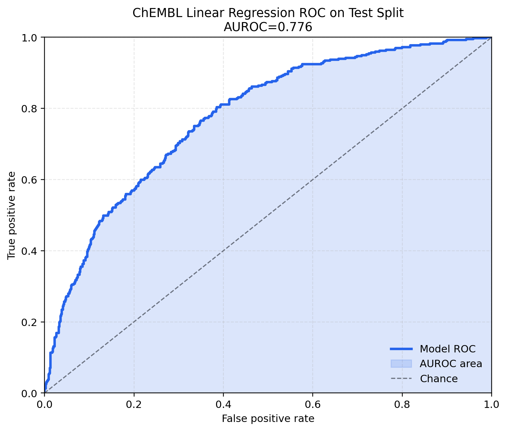
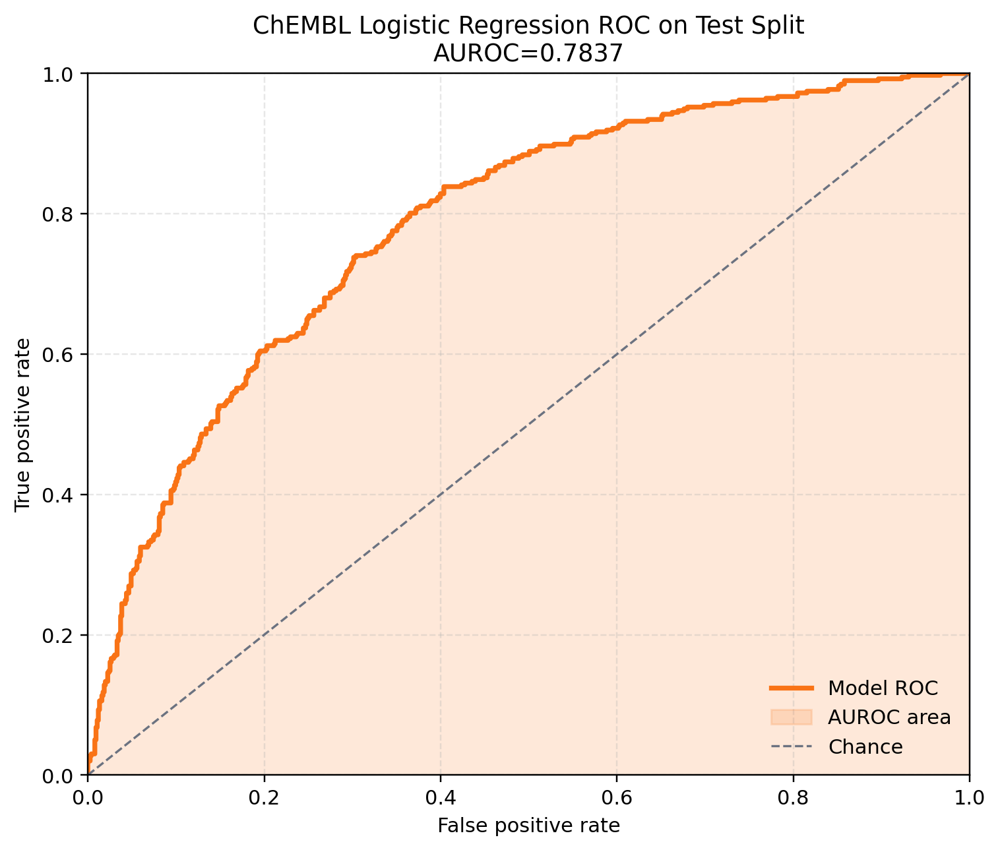

# ChEMBL Baseline Models

- Export path: /Users/ismailcherkaouiaadil/Library/Mobile Documents/com~apple~CloudDocs/Molecular-similarity/data/chembl_modeling.csv
- Selected feature set: structure_enriched
- Selected probability threshold: 0.45
- Rows: 12015
- Split counts: train=9618, val=1247, test=1150

## Linear Regression

| split | mse | mae | accuracy | precision | recall | f1 | auroc |
| --- | ---: | ---: | ---: | ---: | ---: | ---: | ---: |
| development | 0.0284 | 0.1331 | 0.6941 | 0.6209 | 0.7137 | 0.664 | 0.7793 |
| test | 0.0285 | 0.1345 | 0.6948 | 0.6171 | 0.7398 | 0.6729 | 0.776 |

## Logistic Regression

| split | log_loss | brier | accuracy | precision | recall | f1 | auroc |
| --- | ---: | ---: | ---: | ---: | ---: | ---: | ---: |
| development | 0.5221 | 0.1736 | 0.7449 | 0.6554 | 0.5651 | 0.6069 | 0.7868 |
| test | 0.5301 | 0.1767 | 0.7313 | 0.6243 | 0.5567 | 0.5885 | 0.7837 |

## AUROC Curves

