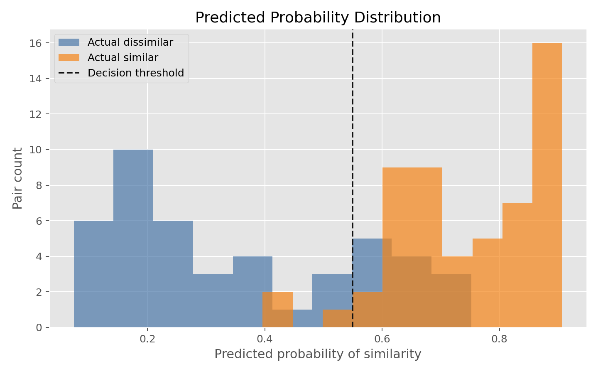
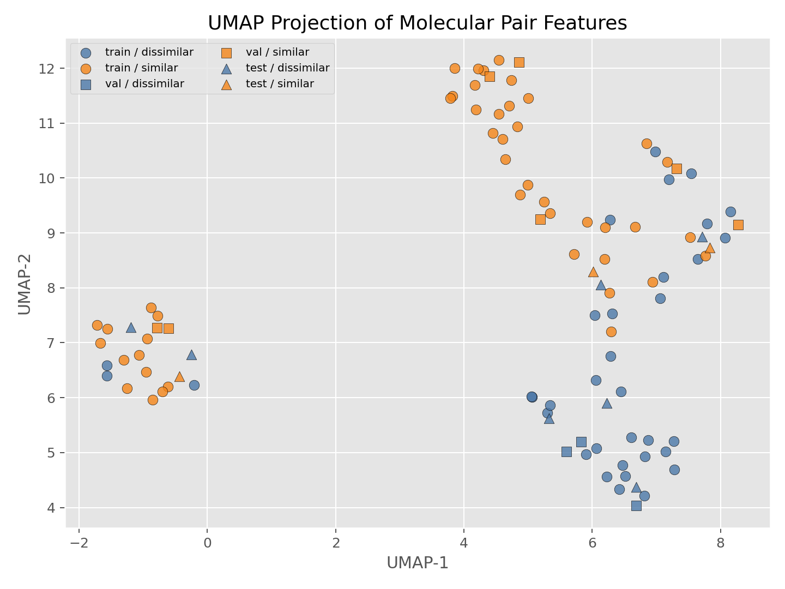

# Threshold-Based Similarity Model

- Similarity label threshold: 0.5
- Selected probability threshold: 0.6
- Selected feature set: core_similarity
- Selected L2 penalty: 0.1
- Rows: 100
- Feature counts: numeric=3, categorical=3
- Split counts: train=80, val=10, test=10

## Model Selection

- Cross-validation summary: folds=5, mean_f1=0.9131, mean_accuracy=0.8991, mean_log_loss=0.3704

## Classification Metrics

| split | log_loss | brier | accuracy | precision | recall | f1 |
| --- | ---: | ---: | ---: | ---: | ---: | ---: |
| development | 0.3664 | 0.1072 | 0.9 | 0.9057 | 0.9231 | 0.9143 |
| test | 0.6272 | 0.2228 | 0.7 | 0.5 | 0.6667 | 0.5714 |

## Plots

### Probability Distribution

### UMAP Projection

The UMAP view projects molecule-pair feature vectors into 2D; colors show actual similarity labels.

## Test Predictions

| pair_id | target | type | frac_similar | actual_label | probability | predicted_label |
| --- | --- | --- | ---: | ---: | ---: | ---: |
| 004 | HERG | dis2D,sim3D | 0.75 | 1 | 0.585 | 0 |
| 014 | 5HT2B | dis2D,sim3D | 0.4545 | 0 | 0.5671 | 0 |
| 015 | 5HT2B | dis2D,sim3D | 0.65 | 1 | 0.6402 | 1 |
| 018 | HERG | dis2D,sim3D | 0.4483 | 0 | 0.5569 | 0 |
| 029 | CYP2D6 | sim2D,dis3D | 0.4783 | 0 | 0.7521 | 1 |
| 032 | CYP2D6 | sim2D,dis3D | 0.381 | 0 | 0.7117 | 1 |
| 036 | CYP2D6 | sim2D,dis3D | 0.6471 | 1 | 0.6526 | 1 |
| 082 | 5HT2B | dis2D,dis3D | 0.1875 | 0 | 0.2346 | 0 |
| 087 | 5HT2B | dis2D,dis3D | 0.0 | 0 | 0.0798 | 0 |
| 095 | HERG | dis2D,dis3D | 0.0 | 0 | 0.2 | 0 |
