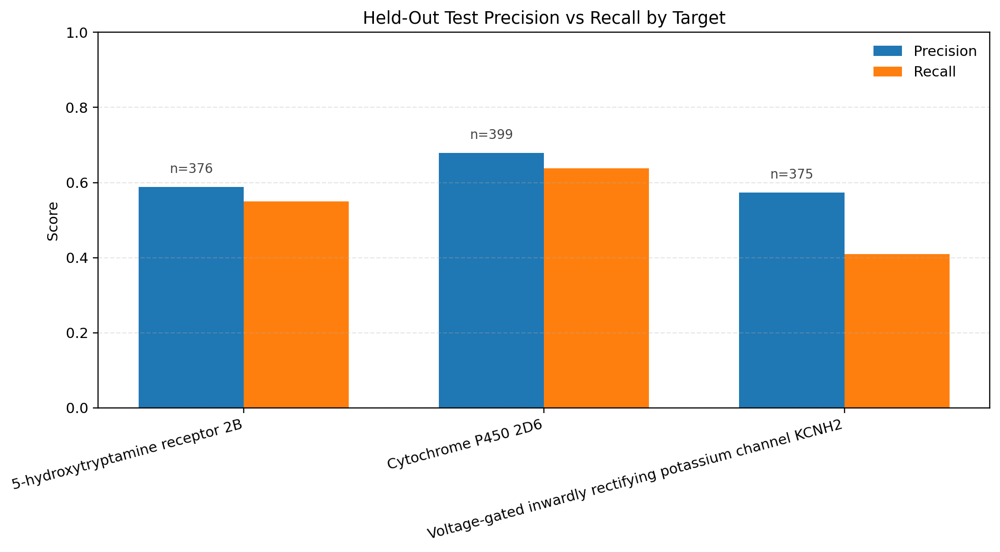
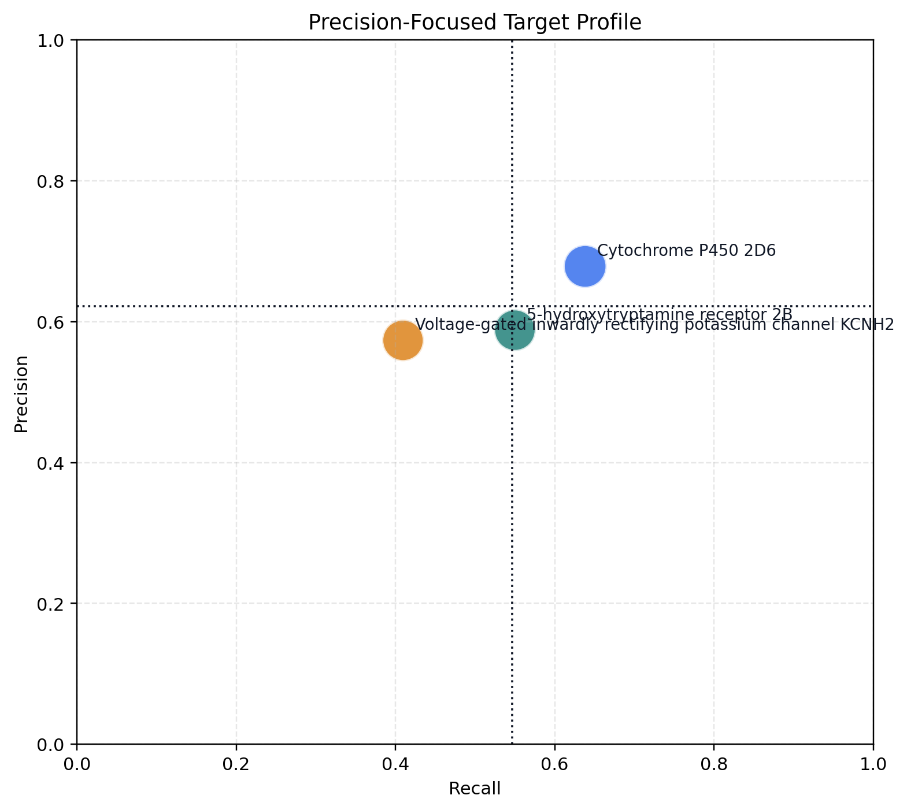

# SQL Activity Pair Model

- Export path: /app/data/chembl_modeling.csv
- Selected feature set: structure_enriched
- Selected probability threshold: 0.45
- Selected L2 penalty: 0.5
- Rows: 12015
- Split counts: train=9618, val=1247, test=1150
- Label balance: similar=4184, dissimilar=7831
- Precision-focused highlight: Cytochrome P450 2D6 has the strongest test precision at 0.6783

## Validation Selection

- Validation metrics: accuracy=0.7426, f1=0.6002, log_loss=0.5126

## Classification Metrics

| split | log_loss | brier | accuracy | precision | recall | f1 |
| --- | ---: | ---: | ---: | ---: | ---: | ---: |
| development | 0.5225 | 0.1737 | 0.7463 | 0.6594 | 0.5632 | 0.6075 |
| test | 0.5306 | 0.1768 | 0.7287 | 0.6218 | 0.5466 | 0.5818 |

## Per-Target Test Metrics

| target | samples | similar | dissimilar | log_loss | brier | accuracy | precision | recall | f1 | tp | tn | fp | fn |
| --- | ---: | ---: | ---: | ---: | ---: | ---: | ---: | ---: | ---: | ---: | ---: | ---: | ---: |
| 5-hydroxytryptamine receptor 2B | 376 | 140 | 236 | 0.569 | 0.1943 | 0.6888 | 0.5878 | 0.55 | 0.5683 | 77 | 182 | 54 | 63 |
| Cytochrome P450 2D6 | 399 | 152 | 247 | 0.5421 | 0.1785 | 0.7469 | 0.6783 | 0.6382 | 0.6576 | 97 | 201 | 46 | 55 |
| Voltage-gated inwardly rectifying potassium channel KCNH2 | 375 | 105 | 270 | 0.4797 | 0.1575 | 0.7493 | 0.5733 | 0.4095 | 0.4778 | 43 | 238 | 32 | 62 |

## Precision View

- Best precision target: Cytochrome P450 2D6 (precision=0.6783, recall=0.6382)
- Lowest recall target: Voltage-gated inwardly rectifying potassium channel KCNH2 (precision=0.5733, recall=0.4095)

## Plots

## Test Predictions

| pair_id | target | type | similarity_score | activity_delta | actual_label | probability | predicted_label |
| --- | --- | --- | ---: | ---: | ---: | ---: | ---: |
| ACT_CHEMBL1833_EC50_178252_362073 | 5-hydroxytryptamine receptor 2B | EC50 | 0.7686 | 0.301 | 1 | 0.6544 | 1 |
| ACT_CHEMBL1833_EC50_178252_179329 | 5-hydroxytryptamine receptor 2B | EC50 | 0.5 | 1.0 | 1 | 0.4911 | 1 |
| ACT_CHEMBL1833_EC50_178252_415029 | 5-hydroxytryptamine receptor 2B | EC50 | 0.379 | 1.6383 | 0 | 0.5506 | 1 |
| ACT_CHEMBL1833_EC50_178252_202656 | 5-hydroxytryptamine receptor 2B | EC50 | 0.3548 | 1.8182 | 0 | 0.4406 | 0 |
| ACT_CHEMBL1833_EC50_178252_210215 | 5-hydroxytryptamine receptor 2B | EC50 | 0.3545 | 1.821 | 0 | 0.4991 | 1 |
| ACT_CHEMBL1833_EC50_178252_178366 | 5-hydroxytryptamine receptor 2B | EC50 | 0.3218 | 2.1079 | 0 | 0.792 | 1 |
| ACT_CHEMBL1833_EC50_178252_201062 | 5-hydroxytryptamine receptor 2B | EC50 | 0.2988 | 2.3468 | 0 | 0.442 | 0 |
| ACT_CHEMBL1833_EC50_80731_178252 | 5-hydroxytryptamine receptor 2B | EC50 | 0.285 | 2.5086 | 0 | 0.3382 | 0 |
| ACT_CHEMBL1833_EC50_178252_202458 | 5-hydroxytryptamine receptor 2B | EC50 | 0.2703 | 2.699 | 0 | 0.3024 | 0 |
| ACT_CHEMBL1833_EC50_76781_178252 | 5-hydroxytryptamine receptor 2B | EC50 | 0.229 | 3.3665 | 0 | 0.1763 | 0 |
| ACT_CHEMBL1833_EC50_178566_197646 | 5-hydroxytryptamine receptor 2B | EC50 | 0.5186 | 0.9281 | 1 | 0.5922 | 1 |
| ACT_CHEMBL1833_EC50_178566_361742 | 5-hydroxytryptamine receptor 2B | EC50 | 0.4744 | 1.1079 | 0 | 0.6908 | 1 |
| ACT_CHEMBL1833_EC50_178124_178566 | 5-hydroxytryptamine receptor 2B | EC50 | 0.4132 | 1.4202 | 0 | 0.6544 | 1 |
| ACT_CHEMBL1833_EC50_178313_178566 | 5-hydroxytryptamine receptor 2B | EC50 | 0.3675 | 1.7212 | 0 | 0.6548 | 1 |
| ACT_CHEMBL1833_EC50_178566_180815 | 5-hydroxytryptamine receptor 2B | EC50 | 0.3333 | 2.0 | 0 | 0.5574 | 1 |
| ACT_CHEMBL1833_EC50_178566_202324 | 5-hydroxytryptamine receptor 2B | EC50 | 0.3288 | 2.041 | 0 | 0.5851 | 1 |
| ACT_CHEMBL1833_EC50_178566_209714 | 5-hydroxytryptamine receptor 2B | EC50 | 0.3138 | 2.1871 | 0 | 0.5721 | 1 |
| ACT_CHEMBL1833_EC50_178566_210802 | 5-hydroxytryptamine receptor 2B | EC50 | 0.3118 | 2.2076 | 0 | 0.4889 | 1 |
| ACT_CHEMBL1833_EC50_179244_360479 | 5-hydroxytryptamine receptor 2B | EC50 | 0.7686 | 0.301 | 1 | 0.5251 | 1 |
| ACT_CHEMBL1833_EC50_179244_180668 | 5-hydroxytryptamine receptor 2B | EC50 | 0.5 | 1.0 | 1 | 0.3115 | 0 |
